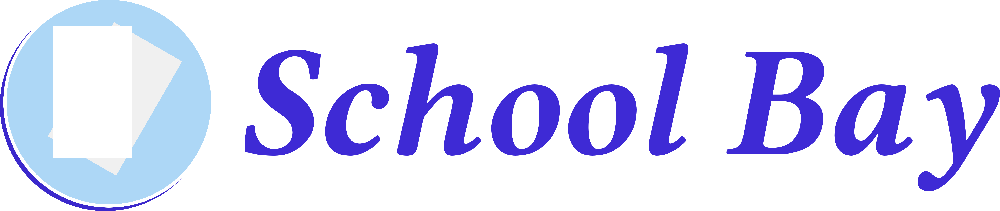

# School Bay

*More information on the project will be released soon!*

### Info
- School Bay is a free and open source platform focused on coordinating student projects and enhancing student-student and student-teacher communication.
- This project is licenced under the GPL-3.0 Licence. For more information see [here](LICENSE.md).

### Issues
- Report any issues to the [github issues](../../issues) page.
- Check if you have the correct versions and dependencies and include all data possible.
